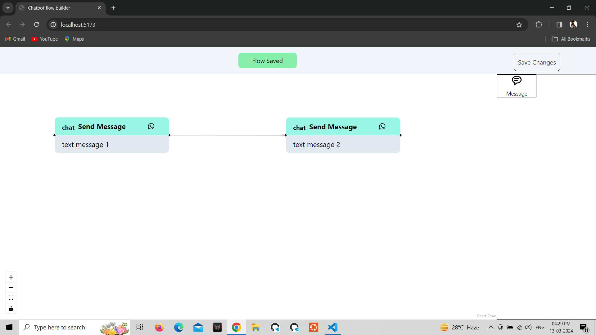
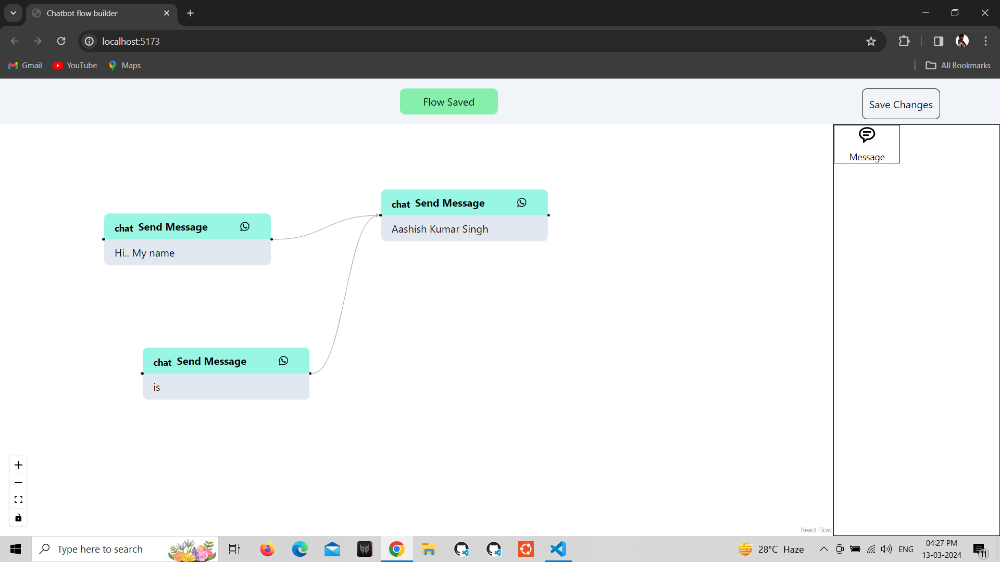
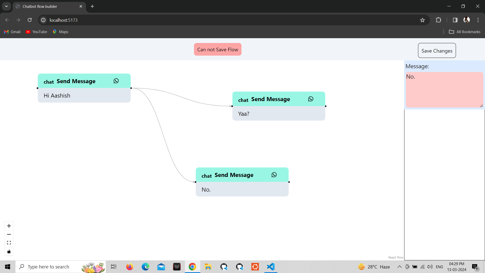
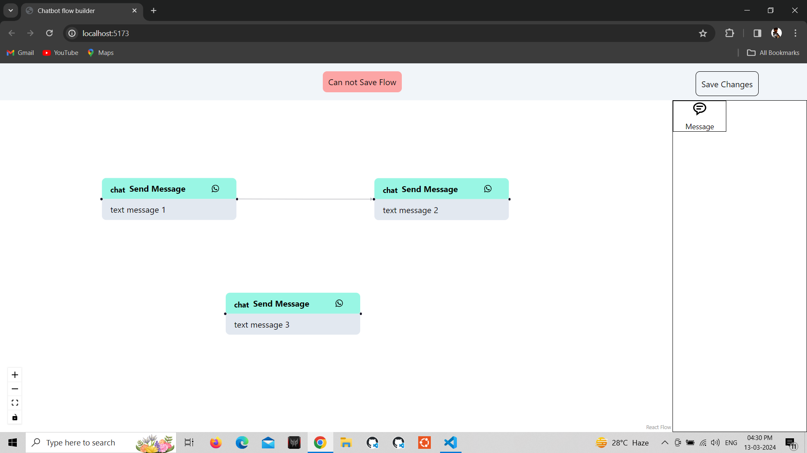

#  Chatbot flow builder [Full Stack Task]
 

A simple Chatbot flow builder using React and the code is  extensible to easily add new features. 
A chatbot flow is built by connecting multiple messages together to decide the order of execution.

## Deployment

### link for project demo: [https://chat-bot-flow.vercel.app/](https://chat-bot-flow.vercel.app/)

## Library/Tool used 

[React](http://reactjs.org) , [React Flow](https://reactflow.dev/), [React-icons](https://react-icons.github.io/react-icons/) and [Tailwind-css](https://tailwindcss.com/).

## Features:

1. **Text Node** 
    1. Our flow builder currently supports only one type of message (i.e Text Message).
    2. There can be multiple Text Nodes in one flow.
    3. Nodes are added to the flow by dragging and dropping a Node from the Nodes Panel.
2. **Nodes Panel** 
    1. This panel houses all kind of Nodes that our Flow Builder supports.
    2. Right now there is only Message Node, but we’d be adding more types of Nodes in the future so make this section extensible 
3. **Edge**
    1. Connects two Nodes together
    

4. **Source Handle**
    1. Source of a connecting edge 
    2. Can only have **one edge** originating from a source handle
5. **Target Handle** 
    1. Target of a connecting edge
    2. Can have **more than one edge** connecting to a target handle 
    

6. **Settings Panel**
    
    1. Settings Panel will replace the Nodes Panel when a Node is selected
    2. It has a text field to edit text of the selected Text Node
7. **Save Button**

    1. Button to save the flow 
    2. **Save button press will show an error if there are more than one Nodes and more than one Node has empty target handles**

## Working with Chatbot Flow builder

1. Drag and Drop the message icon to generate new message node.
2. Click to the genrated node to write your text.
3. Again click on same node to save the text.
4. Save the Flow.

## Scripts to run locally and Deployment

In the project directory, you can run:

Clone this project using

### `git clone https://www.github.com/ashdude/chatBotFlow.git`

Install all dependencies using

### `npm install`

And run this project locally using

### `npm run dev`

This script starts the app in the development mode.\
Open [http://localhost:5173](http://localhost:5173) to view it in your browser.

The page will reload when you make changes.\
As we're using SPA(Single Page Apllication) ie [React](http://reactjs.org).

### `npm run build`

To build this project 

## Refrences

[ReactFlow Drag and Drop](https://reactflow.dev/examples/interaction/drag-and-drop)

[React Flow Documentation](https://reactflow.dev/)
